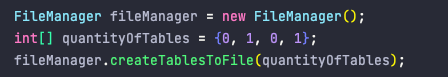
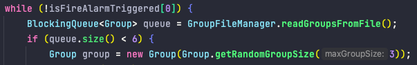
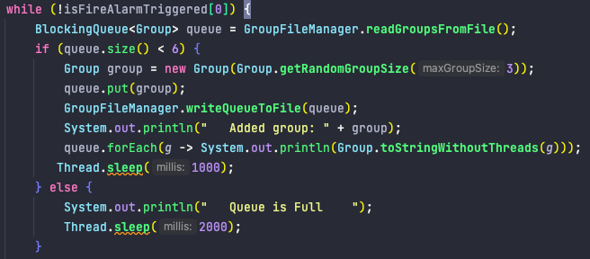
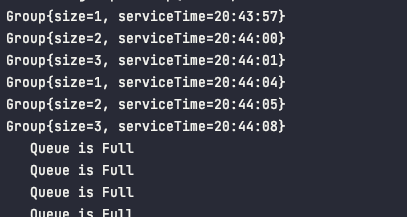
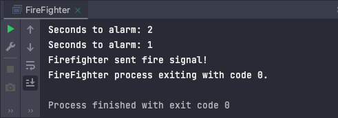
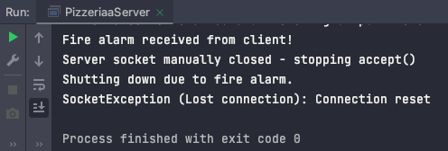
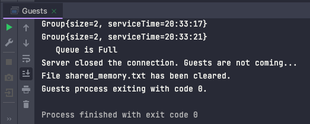
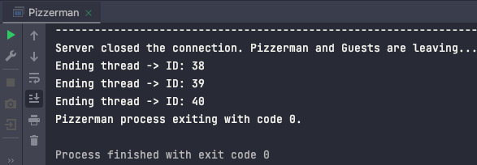

# Raport Projektu – System Wieloprocesowy i Wielowątkowy

**Instrukcja uruchamiania aplikacji na Linuxie**

Przejdź do katalogu src/main gdzie znajdują się wszystkie pliki projektu (java/app i java/model).

--------
    cd /ścieżka/do/projektu/src/main

**Utwórz katalog out**

     mkdir -p out
**Skompiluj wszystkie klasy**

    javac -d out $(find java -name "*.java")

**Utwósrz skrypt jako run_app.sh w katalogu src/main:**

    nano run.sh

**Zawrzyj w nim**

    #!/bin/bash

    gnome-terminal -- bash -c "cd $(pwd) && java -cp out app.PizzeriaServer; exec bash"
    sleep 2        # Czekaj, aż serwer się uruchomi

    gnome-terminal -- bash -c "cd $(pwd) && java -cp out app.Guests; exec bash"

    gnome-terminal -- bash -c "cd $(pwd) && java -cp out app.Pizzerman; exec bash"

    gnome-terminal -- bash -c "cd $(pwd) && java -cp out app.FireFighter; exec bash"

**Nadaj uprawnienia do wykonania skryptu**

    chmod +x run.sh

**uruchom skrypt**

    ./run.sh

    
# Po konsultacji w P.Wojtasem
Projekt spełnia główny cel: prezentację wieloprocesowej, wielowątkowej aplikacji, w której sygnał pożaru może natychmiast przerwać pracę wszystkich procesów, lecz jendak na trudność w javie tworzenia procesów w porównaniu do np C++ gdzie mamy funkcje systemowe fork() i exec(), mamy tylko 4 procesy a większość tworzenia wątków odbywa się w Procesie **Pizzerman**

## 1. Założenia projektowe

Projekt stanowi przykład **niescentralizowanego** systemu, w którym kilka procesów współdziała przy pomocy gniazd (socketów). Zamiast jednej aplikacji, która zarządza wszystkimi działaniami, każdy proces(np. `Guests`, `Pizzerman`, `FireFighter`, `PizzeriaServer`) jest uruchamiany osobno, a komunikacja między nimi odbywa się asynchronicznie, po sieci (lub lokalnie na komputerze) przy użyciu protokołu TCP.
**Tworzenie procesów w Javie** nie jest tak proste jak w C/C++, gdzie mamy wbudowane `fork()`, `exec()`, `wait()` itp. W naszym projekcie oddzielne procesy uruchamiane są jako osobne aplikacje (każda ma metodę `main`). Procesy komunikują się przez sieć z użyciem `socket()`, `accept()`, `connect()`, `readLine()`, `write()` zamiast „typowych” wywołań systemowych `fork()` czy `exec()`.

**Cele projektu** obejmują:
- Implementację prostego serwera nasłuchującego sygnałów alarmowych.
- Uruchamianie kilku procesów-klientów (`Guests`, `Pizzerman`, `FireFighter`.
- Komunikację między procesami z użyciem gniazd.
- Obsługę stanu awaryjnego (pożaru), gdzie proces `FireFighter` wyzwala alarm, a serwer powiadamia pozostałe procesy o konieczności ewakuacji.

## 2. Ogólny opis kodu

- **PizzeriaServer** – tworzy gniazdo serwera (socket), nasłuchuje na określonym porcie i uruchamia wątki (`ClientHandler`) dla każdego nowego połączenia. Odbiera komunikaty, takie jak „fire”.
- **Guests** – symuluje przychodzących gości ustawiaqjących sie w kolejce przed lokalem. Łączy się z serwerem, odbiera komunikat „evacuation” i kończy pracę po otrzymaniu sygnału pożaru lub po zamknięciu gniazda przez serwer.
- **Pizzerman** – symuluje pracę pizzermana, tworzy wątki obsługujące gości (np. `runNewThreadForEachGuest`), zarządza zasobami stołów i kolejkami. Reaguje na sygnał „evacuation”.
- **FireFighter** – wysyła sygnał „fire”, który serwer rozpoznaje i ustawia stan awaryjny.

**Komunikacja między procesami** w tym projekcie opiera się na gniazdach:

- Serwer `PizzeriaServer` nasłuchuje na porcie `9876`.
- Procesy klienckie (`Guests`, `Pizzerman`, `FireFighter`) łączą się z adresem `localhost:9876`.
- Proces `FireFighter` wysyła sygnał „fire”, serwer rozpoznaje go i wysyła do wszystkich aktualnie połączonych klientów komunikat „evacuation”.
- Pozostałe procesy `Guests`, `Pizzerman` po otrzymaniu „evacuation” zakańczają swoje pętle i się wyłączają.

## 3. Zakładany proces działania symulacji

1. **Standardowa praca**:
    - `Guests` i `Pizzerman` łączą się z serwerem `PizzeriaServer` wykonując swoją pracę, nasłuchując sygnału alarmu.
2. **Sygnał awaryjny (pożar)**:
    - `FireFighter` wysyła wiadomość „fire”. Serwer ustawia stan awaryjny i odsyła „evacuation” do klientów, po czym kończy działanie. Klienci także się wyłączają.

## 4. Obsługa błędów i uprawnień

- W Javie zamiast `perror()` i zmiennej `errno` stosuje się konstrukcje wyjątków `try/catch`.
- Byłoby możliwe użycie `FilePermission` czy `SocketPermission` – jednakże w typowej aplikacji uruchamianej w trybie zwykłego użytkownika minimalne prawa są domyślnie zapewnione przez system.
- Wszelkie pliki tymczasowe (np. `shared_memory.txt`) są czyszczone i zwalniane po zakończeniu działania aplikacji (metoda `clearFile()`).

## 5. Z czym były problemy i co się udało

- **Problemy**:
    - Konieczność synchronizowania wątków w `Pizzerman` (np. przerwanie wątków gości) tak, aby proces rzeczywiście kończył się, gdy nadchodzi sygnał ewakuacji.
    - Kończenie wszystkich wątków w procesach by te mogły zakończyć swoje działanie
    - kończenie życia obiektów gości opuszczających pizzerię po zadanym czasie i kończenie ich wątków.
- **Udało się**:
    - Rozwiązać komunikację przez `socket()`, `bind()`, `accept()`, `connect()` w Javie.
    - Zaimplementować sytuację alarmową: „fire” → „evacuation”.
    - Zaimplementować wielowątkowość (dla gości) i prostą synchronizację kolejki (blokady w pliku i wątkach).
    - Proces, w którym dane tekstowe (np. linie w pliku) są przekształcane w obiekty w pamięci (Group, Table, itp.), przypomina mapowanie relacji (np. z tabel w bazie danych) na obiekty w aplikacji.
    - Pliki współdzielone działaja jako centralne miejsce przechowywania stanu.

## 6. Dodatkowe elementy i testy

- **Element specjalny**: wykorzystanie pliku `shared_memory.txt` (przez `FileLock`) do współdzielenia kolejek pomiędzy różnymi procesami (podejście zbliżone do pamięci dzielonej, ale w Javie).

-    **Testy**:
-------------

- **tworzenie stolików liczebności stolików wprowadzone dane**  

**rezultat** :

     Table{initialCapacity=2, capacity=2, isOccupied=false, groups=[]}
  
     Table{initialCapacity=4, capacity=4, isOccupied=false, groups=[]}

---------------------------------------------------------------------------------
- **dodawanie grup gości (max 3 osoby) do kolejki czekającej przed lokalem**

- **rezultat** :

     Group{size=3, serviceTime=19:56:54}
  
     Group{size=2, serviceTime=19:56:55}
  
     Group{size=3, serviceTime=19:56:58}
  
     Group{size=2, serviceTime=19:56:59}
  
     Group{size=1, serviceTime=19:57:02}
  
     Group{size=2, serviceTime=19:57:03}

----------
- **Gdy kolejka jest pełna nie dodają się  grupy gości do kolejki czekającej przed lokalem(max 6 grup)**

- rezultat

-----------------------------------
- **Kończenie wszystkich procesów po wysłaniu sygnału `fire` przez strażaka**

- wysłanie sygnału

 
- rezultat

-------------------------------
## 7. Linki do istotnych fragmentów kodu

Poniżej kilka przykładów linków do repozytorium GitHub, prezentujących najważniejsze funkcje systemowe w projekcie:
- **Obsługa gniazd (socketów)**:
    - [`PizzeriaServer.main`](https://github.com/MichalKruczala/Pizzeria/blob/49113d03119beef3df22f293a4c706c0f0e640e7/src/main/java/app/PizzeriaServer.java#L19)  
      Uruchamia serwer nasłuchujący na porcie 9876. Akceptuje połączenia przychodzące, tworząc wątki do obsługi klientów.
    - [`Guests.main`](https://github.com/MichalKruczala/Pizzeria/blob/49113d03119beef3df22f293a4c706c0f0e640e7/src/main/java/app/GroupFileManager.java#L35)  
      Proces pisiadający dwa wątki, jeden dodaje grupy gości do kolejki ,drugi łączy się z serwerem jako klient i odbiera komunikaty, takie jak „evacuation”.

- **Tworzenie i obsługa plików**:
    - [`GroupFileManager.writeQueueToFile`](https://github.com/MichalKruczala/Pizzeria/blob/49113d03119beef3df22f293a4c706c0f0e640e7/src/main/java/app/GroupFileManager.java#L16)  
      Zapisuje stan kolejki grup do pliku `shared_memory.txt`, używając blokady pliku (`FileLock`). Funkcja czyści zawartość pliku i zapisuje każdą grupę w formacie tekstowym. Synchronizacja zapisu pozwala na współdzielenie danych przez wiele procesów.
    - [`GroupFileManager.readGroupsFromFile`](https://github.com/MichalKruczala/Pizzeria/blob/49113d03119beef3df22f293a4c706c0f0e640e7/src/main/java/app/GroupFileManager.java#L35)  
      Odczytuje dane grup z pliku `shared_memory.txt`, tworząc z nich kolejkę `BlockingQueue<Group>`. Blokada współdzielona (`FileLock`) zapewnia bezpieczeństwo danych podczas odczytu.

- **Tworzenie procesów i wątków**:
    - [`Pizzerman.runNewThreadForEachGuest`](https://github.com/MichalKruczala/Pizzeria/blob/49113d03119beef3df22f293a4c706c0f0e640e7/src/main/java/app/Pizzerman.java#L126)  
      Tworzy nowe wątki dla każdego gościa w grupie, które działają do momentu przerwania (`Thread.interrupt()`). Wątki reprezentują obsługę klientów przez pizzermana.
    - [`PizzeriaServer.ClientHandler.run`](https://github.com/MichalKruczala/Pizzeria/blob/49113d03119beef3df22f293a4c706c0f0e640e7/src/main/java/app/PizzeriaServer.java#L69)  
      Obsługuje pojedyncze połączenie przychodzące, nasłuchując komunikaty od klienta. Odpowiada za reakcje na „fire” i „evacuation”.

- **Synchronizacja odczytu plików**:
    - [`FileManager`](https://github.com/MichalKruczala/Pizzeria/blob/49113d03119beef3df22f293a4c706c0f0e640e7/src/main/java/app/FileManager.java#L18)  
      Tworzy plik zawierający dane o dostępnych stolikach w pizzerii.Zapisuje i odczytuje ich stan używając mechanizmów synchronizacji plikowych(Semaphore) w celu zachowania integralności danych.
    - [`GroupFileManager`](https://github.com/MichalKruczala/Pizzeria/blob/49113d03119beef3df22f293a4c706c0f0e640e7/src/main/java/app/GroupFileManager.java#L12)  
      Odczytuje/Zapisuje stan kolejki przed pizzerią w pliku `shared_memory.txt`, synchronicznie blokując go podczas operacji za pomocą `FileLock`.

- **Obsługa sygnałów i stanu awaryjnego**:
    - [`FireFighter.main`](https://github.com/MichalKruczala/Pizzeria/blob/49113d03119beef3df22f293a4c706c0f0e640e7/src/main/java/app/FireFighter.java#L8)  
      Proces zawirający wątke symulujący strażaka, który łączy się z serwerem i wysyła sygnał „fire”. Sygnał uruchamia globalny stan awaryjny, na który reagują inne procesy.
    - [`Guests/Pizzerman( Thread serverListenerThread )`](https://github.com/MichalKruczala/Pizzeria/blob/49113d03119beef3df22f293a4c706c0f0e640e7/src/main/java/app/Guests.java#L45)  
      Wątek nasłuchuje sygnałów z serwera, takich jak „evacuation”. Po otrzymaniu sygnału zamyka swoje połączenie i kończy inne wątki oraz cały proces .

      

## 8. Opis ważniejszych funkcji + linki

1. **[`PizzeriaServer.ClientHandler.run()`](https://github.com/MichalKruczala/Pizzeria/blob/49113d03119beef3df22f293a4c706c0f0e640e7/src/main/java/app/PizzeriaServer.java#L69)**  
   Obsługuje pojedyncze połączenie klienckie: czyta linie w pętli i reaguje na komunikaty („fire” → ustawia isFire = true; w odpowiedzi wysyła „evacuation”).

2. **[`Guests.main(String[] args)`](https://github.com/MichalKruczala/Pizzeria/blob/49113d03119beef3df22f293a4c706c0f0e640e7/src/main/java/app/Guests.java#L12)**  
   Funkcja która posiada dwa wątki: jeden dodaje grupy gości do kolejki, drugi łączy się z serwerem, nasłuchuje komunikatu „evacuation” lub rozłączenia, co kończy pętlę główną.

1. **[`Pizzerman.removeGroupsAndTheirThreadsAfterCertainTime(List<Table> tables, int timeLimitInSeconds)`](https://github.com/MichalKruczala/Pizzeria/blob/49113d03119beef3df22f293a4c706c0f0e640e7/src/main/java/app/Pizzerman.java#L147)**  
   Funkcja która przyjmuje listę stołów i ich grup oraz czas, po którym grupa powinna opuścić stolik. Funkcja modyfikuje listę, usuwając grupy na podstawie ich czasów obsłużenia.

2. **[`Pizzerman.tryAssignGroupToTable(Group group, List<Table> tablesSortedByCapacity)`](https://github.com/MichalKruczala/Pizzeria/blob/49113d03119beef3df22f293a4c706c0f0e640e7/src/main/java/app/Pizzerman.java#L103)**  
   Funkcja tryAssignGroupToTable próbuje przypisać grupę gości (Group) do odpowiedniego stolika (Table) na podstawie dostępnej pojemności stolików i ich zajętości.  
   Iteruje przez listę stolików posortowanych według pojemności (tablesSortedByCapacity) i sprawdza, czy stolik jest wolny i ma wystarczającą pojemność oraz czy wszystkie grupy są równe aby obsłużyć daną grupę. Jeśli takie warunki zostaną spełnione, funkcja dodaje grupę do stolika, zmniejsza jego capacity, aktualizuje czas obsługi grupy i uruchamia wątek dla każdego gościa w tej grupie za pomocą metody runNewThreadForEachGuest. Funkcja zwraca `true`, jeśli udało się przypisać grupę do stolika, a `false` w przeciwnym wypadku.

3. **[`Pizzerman.runNewThreadForEachGuest(Group group)`](https://github.com/MichalKruczala/Pizzeria/blob/49113d03119beef3df22f293a4c706c0f0e640e7/src/main/java/app/Pizzerman.java#L126)**  
   Tworzy nowe wątki (po jednym na gościa), które działają w pętli i czekają do momentu przerwania (`Thread.interrupt()`).

4. **[`FireFighter.main(String[] args)`](https://github.com/MichalKruczala/Pizzeria/blob/49113d03119beef3df22f293a4c706c0f0e640e7/src/main/java/app/FireFighter.java#L8)**  
   Jednorazowy proces: łączy się z serwerem i wysyła komunikat „fire”. Następnie kończy działanie.

5. **[`GroupFileManager.writeQueueToFile(BlockingQueue<Group> queue)`](https://github.com/MichalKruczala/Pizzeria/blob/49113d03119beef3df22f293a4c706c0f0e640e7/src/main/java/app/GroupFileManager.java#L16)**  
   Otwiera plik `shared_memory.txt` w trybie rw, blokuje go (`FileLock`), czyści zawartość i zapisuje aktualny stan kolejki. Pozwala to innym procesom odczytać kolejkę ze wspólnego pliku.

6. **[`GroupFileManager.readGroupsFromFile()`](https://github.com/MichalKruczala/Pizzeria/blob/49113d03119beef3df22f293a4c706c0f0e640e7/src/main/java/app/GroupFileManager.java#L35)**  
   Otwiera ten sam plik w trybie „read-only” i przy użyciu blokady współdzielonej (`lock(0, Long.MAX_VALUE, true)`) odczytuje wszystkie linie, tworząc obiekty `Group`.

7. **[`FileManager.createTablesToFile(int[] quantityOfTables)`](https://github.com/MichalKruczala/Pizzeria/blob/49113d03119beef3df22f293a4c706c0f0e640e7/src/main/java/app/FileManager.java#L22)**  
   Tworzy plik z informacjami o stolikach (ich liczba, pojemność). Używa `open()`, `write()`, `close()` (zastąpione w Javie przez `FileWriter`/`RandomAccessFile`). Wprowadzane dane (

---

## 9. Zakończenie i wnioski

- **Usuwanie struktur**: Po zamknięciu aplikacji pliki tymczasowe są usuwane (lub czyszczone metodą `clearFile()`), a wątki i sockety – zamykane.
- **Wdrożono**
-     Synchronizację dzielonych plików używając odpowiedznich narzędzi
-     Rozbudowanie obsługę błędów i raportowanie wyjątków (np. `try-catch` z wypisaniem `System.err.println(e.getMessage())`).
-     Wykorzystanie Procesów, systemowe wywołania w stylu `fork()`, `exec()`  jak (w C/C++), by w pełni spełnić wymóg tworzenia procesów z poziomu kodu. W Javie jednak w większości procesy uruchamiamy osobno.
-     Algorytm jak najkorzystniejszego przydzielania stolikom grup by zmaksymalizować zapełnienie sali
-     Mechanizm opuszczania przez klientów restauracji
-     Całkowite zakończenie procesów po otrzymaniu sygnału "fire"

**Całość** projektu spełnia główny cel: prezentację wieloprocesowej, wielowątkowej aplikacji, w której sygnał pożaru może natychmiast przerwać pracę wszystkich procesów i ich wątków.

